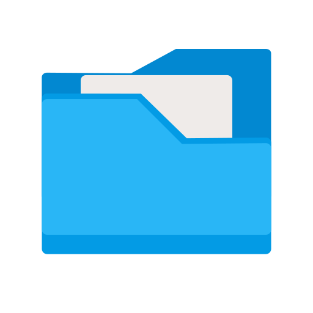

# Codebrewers-hackathon

# Disk Space Manager  

## Table of Contents
- [Introduction](#introduction)
- [Quick Demo](#quick-demo) 
- [Features](#features)
- [Installation](#installation)
- [Usage](#usage)
- [Screenshots](#screenshots)
- [License](#license)

## Introduction

Welcome to Disk Space Management App! This Python application is built using the Tkinter library, provides a user-friendly interface to scan for duplicate files and manage system memory efficiently. With this app, you can quickly locate and remove duplicate files, freeing up infrequently accessed files, viewing disk memory utilization based on drive, directory, file types, etc.

## Quick Demo
Explore the application by downloading and running the [gui.exe](https://github.com/coderSuren/Codebrewers-hackathon/releases/tag/v1.0.0)

## Features
It uses the xxHash hashing algorithm to achieve faster performance and facilitate duplicate retrieval.

### Comparison of different hashing algorithms:


### Achieved Requirements:
- [x] Display free space available on the disk
- [x] Breakdown of space utilization based on disks, file type, etc.
- [x] Detect duplicate files
- [x] Identify files of larger size
- [x] Faster and efficient deletion algorithms

## Installation

Follow these steps to set up and run the application:

1. Clone the repository to your local machine:

   ```bash
   git clone https://github.com/coderSuren/Codebrewers-hackathon.git
   cd Codebrewers-hackathon
   ```
2. Make sure you have Python 3.x installed on your system. If not, download and install it from [Python's official website](https://www.python.org/downloads/).

3. Install the required dependencies:

   ```bash
   pip install tkinter
   pip install customtkinter
   pip install wmi
   pip install PIL
   ```

4. Run the app:

   ```bash
   python components/gui.py
   ```

## Usage

1. **Duplicate File Scanner**
   - Select the directory or drive you want to scan for duplicate files.
   - Click on the "Scan" button to start the scanning process.
   - After the scan is complete, a list of duplicate files will be displayed with options to delete them.
   - Customize scan settings in the settings menu as needed.

2. 
## Screenshots


## License

This project is licensed under the [MIT License](LICENSE). Feel free to modify and distribute this project following the terms of the MIT License.
